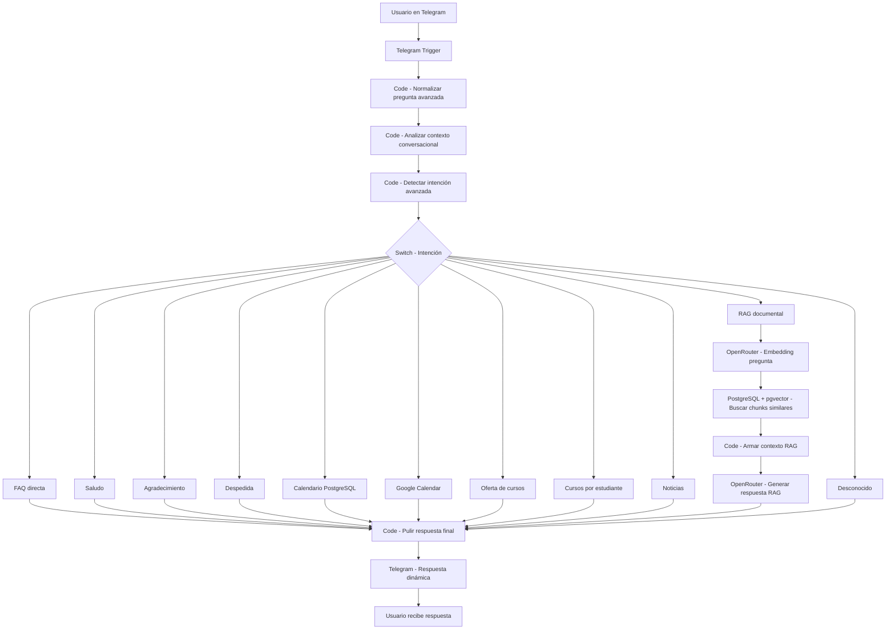

# 🤖 CCD UNAB — Chatbot Inteligente con n8n, PostgreSQL, Telegram y RAG

### Centro de Competencias Digitales · Universidad Autónoma de Bucaramanga · Colombia

> Asistente conversacional institucional para el **Centro de Competencias Digitales CCD UNAB**.  
> Funciona desde **Telegram**, se orquesta con **n8n**, consulta datos estructurados en **PostgreSQL**, realiza búsqueda vectorial con **pgvector** y genera respuestas documentales mediante **RAG** usando **OpenRouter**.


---

## 📋 Tabla de contenidos

1. [Descripción general](#-descripción-general)
2. [Objetivo del proyecto](#-objetivo-del-proyecto)
3. [Características principales](#-características-principales)
4. [Arquitectura general](#-arquitectura-general)
5. [Flujo conversacional](#-flujo-conversacional)
6. [Intenciones soportadas](#-intenciones-soportadas)
7. [Tecnologías utilizadas](#-tecnologías-utilizadas)
8. [Estructura del repositorio](#-estructura-del-repositorio)
9. [Requisitos previos](#-requisitos-previos)
10. [Variables de entorno](#-variables-de-entorno)
11. [Infraestructura](#-infraestructura)
12. [Configuración de puertos](#-configuración-de-puertos)
13. [Despliegue de n8n](#-despliegue-de-n8n)
14. [Configuración de Telegram](#-configuración-de-telegram)
15. [Configuración de PostgreSQL y pgvector](#-configuración-de-postgresql-y-pgvector)
16. [Modelo de datos](#-modelo-de-datos)
17. [Configuración de credenciales en n8n](#-configuración-de-credenciales-en-n8n)
18. [Importar el workflow en n8n](#-importar-el-workflow-en-n8n)
19. [Descripción de ramas del flujo](#-descripción-de-ramas-del-flujo)
20. [Configuración RAG documental](#-configuración-rag-documental)
21. [Pruebas desde Telegram](#-pruebas-desde-telegram)
22. [Checklist de despliegue](#-checklist-de-despliegue)
23. [Comandos útiles de diagnóstico](#-comandos-útiles-de-diagnóstico)
24. [Solución de problemas frecuentes](#-solución-de-problemas-frecuentes)
25. [Seguridad y privacidad](#-seguridad-y-privacidad)
26. [Costos y límites](#-costos-y-límites)
27. [Estado final del proyecto](#-estado-final-del-proyecto)
28. [Próximas mejoras](#-próximas-mejoras)
29. [Créditos](#-créditos)
30. [Licencia](#-licencia)

---

## 📌 Descripción general

Este proyecto implementa un chatbot institucional para el **Centro de Competencias Digitales CCD UNAB**.

El asistente permite responder preguntas frecuentes, saludos, despedidas, consultas de calendario, oferta de cursos, historial de cursos por estudiante, noticias institucionales y preguntas documentales mediante un flujo RAG.

El flujo está diseñado para evitar llamadas innecesarias a modelos de lenguaje. Primero normaliza el mensaje, analiza el contexto conversacional, detecta la intención y enruta la pregunta hacia la rama correspondiente. Finalmente, todas las respuestas pasan por un nodo de pulido antes de enviarse al usuario por Telegram.

---

## 🎯 Objetivo del proyecto

Construir un asistente conversacional que:

- Atienda consultas comunes del CCD de forma rápida.
- Responda en un tono amable, claro e institucional.
- Consulte datos estructurados desde PostgreSQL.
- Permita buscar información documental mediante RAG.
- Use Telegram como canal principal de interacción.
- Sea importable, mantenible y extensible en n8n.
- Reduzca llamadas innecesarias a modelos de lenguaje.
- Permita diagnosticar errores mediante consultas SQL y logs de n8n.

---

## ✨ Características principales

- Atención automática desde Telegram.
- Orquestación visual con n8n.
- Clasificación de intención mediante reglas.
- Respuestas directas para saludos, agradecimientos, despedidas y preguntas frecuentes.
- Consulta de calendario institucional desde PostgreSQL.
- Consulta opcional de eventos desde Google Calendar.
- Consulta de oferta activa de cursos CCD.
- Consulta de cursos asociados a estudiantes por código UNAB o ID.
- Consulta de noticias institucionales.
- Búsqueda documental con PostgreSQL y pgvector.
- Generación de embeddings mediante OpenRouter.
- Generación de respuestas RAG usando contexto documental con múltiples modelos.
- Nodo final de pulido para mantener tono institucional.
- Registro opcional de preguntas sin resolver.
- Arquitectura modular y mantenible.

---

## 🏗️ Arquitectura general



Arquitectura lógica resumida:

```text
Telegram Trigger
  ↓
Code - Normalizar pregunta avanzada
  ↓
Code - Analizar contexto conversacional
  ↓
Code - Detectar intención avanzada
  ↓
Switch - Intencion
  ├─ faq_directa
  ├─ saludo
  ├─ agradecimiento
  ├─ despedida
  ├─ calendario
  ├─ calendario_google
  ├─ oferta_cursos
  ├─ cursos_estudiante
  ├─ noticias
  ├─ rag_documentos
  └─ desconocido
        ↓
Code - Pulir respuesta final
        ↓
Telegram - Respuesta dinamica
```

---

## 🔁 Flujo conversacional

Cada mensaje recibido pasa por estas etapas:

1. **Normalización:** limpieza del texto, detección de palabras clave, extracción de códigos.
2. **Análisis de contexto:** detección de saludos, despedidas, agradecimientos, menciones de fechas o historial.
3. **Detección de intención:** clasificación por reglas hacia una de las ramas del Switch.
4. **Enrutamiento:** el Switch dirige el flujo a la rama correspondiente.
5. **Respuesta:** cada rama genera un campo `respuesta`.
6. **Pulido:** el nodo final ajusta tono, longitud y agrega cierres si faltan.
7. **Envío:** Telegram recibe y entrega la respuesta al usuario.

---

## 🧭 Intenciones soportadas

| Intención | Descripción |
|-----------|-------------|
| `faq_directa` | Preguntas frecuentes con respuesta predefinida |
| `saludo` | Saludos del usuario |
| `agradecimiento` | Expresiones de agradecimiento |
| `despedida` | Despedidas del usuario |
| `calendario` | Consulta de eventos en PostgreSQL |
| `calendario_google` | Consulta de eventos en Google Calendar |
| `oferta_cursos` | Consulta de cursos activos |
| `cursos_estudiante` | Historial académico por código UNAB o ID |
| `noticias` | Noticias institucionales recientes |
| `rag_documentos` | Preguntas documentales con RAG |
| `desconocido` | Preguntas no clasificadas |

---

## 🛠️ Tecnologías utilizadas

| Tecnología | Uso |
|------------|-----|
| Azure VM | Servidor principal |
| Ubuntu Server | Sistema operativo base |
| Docker | Ejecución de contenedores |
| Coolify | Administración de servicios |
| Traefik / Coolify Proxy | Exposición HTTPS |
| n8n | Motor de automatización y orquestación |
| n8n Task Runners | Ejecución de código JavaScript |
| PostgreSQL | Almacenamiento estructurado |
| pgvector | Búsqueda vectorial para RAG |
| Telegram Bot API | Canal de comunicación |
| OpenRouter API | Embeddings y generación de respuestas con múltiples modelos |
| Google Calendar | Eventos opcionales |

---

## 📁 Estructura del repositorio

```text
N8N-Con-Telegram/
├── docs/
│   ├── README_RAG.md
│   ├── VALIDACION_RAG.md
│   ├── diseno-flujo-n8n-chatbot-ccd-unab.md
│   └── guia-implementacion-paso-a-paso.md
├── n8n/
│   └── ccd-chatbot-flujo-principal-mvp-mejorado.json
├── README.md
└── explicacion.md
```

---

## ✅ Requisitos previos

Antes de configurar el proyecto se requiere:

- Una VM Linux disponible.
- Docker instalado o gestionado mediante Coolify.
- Coolify funcionando con proxy HTTPS.
- Una instancia de n8n desplegada.
- Una instancia PostgreSQL con soporte para pgvector.
- Un bot de Telegram creado desde BotFather.
- Una API Key de OpenRouter.
- Opcionalmente, una cuenta de Google con acceso al calendario CCD.

Placeholders usados en esta documentación:

```text
TU_TOKEN_TELEGRAM
TU_API_KEY_OPENROUTER
TU_PASSWORD_POSTGRES
TU_DOMINIO_N8N
```

---

## 🌐 Variables de entorno

Variables de n8n:

```env
N8N_PROTOCOL=https
N8N_HOST=TU_DOMINIO_N8N
WEBHOOK_URL=https://TU_DOMINIO_N8N/
N8N_EDITOR_BASE_URL=https://TU_DOMINIO_N8N/
N8N_SECURE_COOKIE=true
GENERIC_TIMEZONE=America/Bogota
TZ=America/Bogota
N8N_PORT=5678
N8N_RUNNERS_ENABLED=true
N8N_RUNNERS_MODE=external
N8N_PROXY_HOPS=1
```

---

## 🏢 Infraestructura

- **Azure VM:** servidor principal con 4 núcleos, 8 GB RAM y 64 GB de almacenamiento.
- **Ubuntu Server:** sistema operativo base.
- **Docker:** ejecución de contenedores.
- **Coolify:** administración de servicios.
- **Traefik / Coolify Proxy:** exposición HTTPS.
- **n8n:** motor de automatización y orquestación.
- **PostgreSQL:** almacenamiento de datos estructurados y documentos.
- **pgvector:** búsqueda vectorial para RAG.

---

## 🔌 Configuración de puertos

| Puerto | Uso |
|--------|-----|
| 80 TCP | Tráfico HTTP gestionado por el proxy |
| 443 TCP | Tráfico HTTPS gestionado por el proxy |
| 8000 TCP | Acceso a la interfaz de Coolify |

El puerto **5678** corresponde al puerto interno de n8n. No se expone directamente cuando n8n se publica mediante el proxy de Coolify.

---

## 🚀 Despliegue de n8n

1. Crear un nuevo servicio en Coolify.
2. Seleccionar imagen de n8n.
3. Configurar dominio público: `https://TU_DOMINIO_N8N`
4. Configurar variables de entorno.
5. Habilitar HTTPS mediante el proxy de Coolify.
6. Iniciar el servicio.
7. Acceder al editor web de n8n.

---

## 💬 Configuración de Telegram

Telegram requiere que el webhook esté disponible por HTTPS.

1. Crear credencial de Telegram en n8n.
2. Usar el token del bot: `TU_TOKEN_TELEGRAM`
3. Configurar el nodo **Telegram Trigger**.
4. Activar el workflow.
5. Verificar que Telegram pueda entregar mensajes al webhook.

---

## 🗄️ Configuración de PostgreSQL y pgvector

Habilitar la extensión pgvector:

```sql
CREATE EXTENSION IF NOT EXISTS vector;
```

La tabla de chunks usa una columna vectorial con dimensión 1536, correspondiente al modelo `openai/text-embedding-3-small`:

```sql
embedding VECTOR(1536)
```

El proyecto usa dos bases de datos separadas para mantener responsabilidades independientes.

---

## 📊 Modelo de datos

El proyecto utiliza dos bases de datos:

- **Base de datos 1**: almacena información general del chatbot como calendario, oferta de cursos, noticias y preguntas sin resolver.
- **Base de datos 2**: almacena información académica, estudiantes, cursos realizados y documentos usados para RAG.

### Base de datos 1

#### Tabla `calendario_ccd`

```sql
CREATE TABLE IF NOT EXISTS calendario_ccd (
    id SERIAL PRIMARY KEY,
    evento TEXT NOT NULL,
    fecha_inicio DATE,
    fecha_fin DATE,
    descripcion TEXT,
    activo BOOLEAN DEFAULT TRUE,
    fecha_creacion TIMESTAMP DEFAULT CURRENT_TIMESTAMP
);
```

#### Tabla `cursos_ccd`

```sql
CREATE TABLE IF NOT EXISTS cursos_ccd (
    id SERIAL PRIMARY KEY,
    nombre TEXT NOT NULL,
    categoria TEXT,
    descripcion TEXT,
    activo BOOLEAN DEFAULT TRUE,
    fecha_creacion TIMESTAMP DEFAULT CURRENT_TIMESTAMP
);
```

#### Tabla `noticias_ccd`

```sql
CREATE TABLE IF NOT EXISTS noticias_ccd (
    id SERIAL PRIMARY KEY,
    titulo TEXT NOT NULL,
    descripcion TEXT,
    fecha_publicacion DATE,
    enlace TEXT,
    activo BOOLEAN DEFAULT TRUE,
    disponible_chatbot BOOLEAN DEFAULT TRUE,
    fecha_creacion TIMESTAMP DEFAULT CURRENT_TIMESTAMP
);
```

#### Tabla `preguntas_sin_resolver`

```sql
CREATE TABLE IF NOT EXISTS preguntas_sin_resolver (
    id SERIAL PRIMARY KEY,
    pregunta_original TEXT,
    pregunta_normalizada TEXT,
    intencion_detectada TEXT,
    canal TEXT,
    fecha_registro TIMESTAMP DEFAULT CURRENT_TIMESTAMP
);
```

### Base de datos 2

#### Tabla `estudiante`

```sql
CREATE TABLE IF NOT EXISTS estudiante (
    id_estudiante BIGINT PRIMARY KEY,
    codigo_unab TEXT UNIQUE,
    nombre_completo TEXT NOT NULL,
    programa_academico TEXT,
    facultad TEXT,
    anio_ingreso INTEGER,
    semestre_actual INTEGER,
    email TEXT,
    telegram_id BIGINT,
    telefono BIGINT,
    activo BOOLEAN DEFAULT TRUE,
    fecha_creacion TIMESTAMP DEFAULT CURRENT_TIMESTAMP
);
```

#### Tabla `cursos_estudiantes`

```sql
CREATE TABLE IF NOT EXISTS cursos_estudiantes (
    id INTEGER PRIMARY KEY,
    id_estudiante BIGINT,
    codigo_materia TEXT,
    codigo_curso INTEGER,
    nombre_materia TEXT,
    semestre TEXT,
    anio INTEGER,
    fecha_matricula DATE
);

CREATE UNIQUE INDEX IF NOT EXISTS ux_cursos_estudiantes_unico
ON cursos_estudiantes (id_estudiante, codigo_materia, codigo_curso);
```

#### Tabla `documentos_rag`

```sql
CREATE TABLE IF NOT EXISTS documentos_rag (
    id SERIAL PRIMARY KEY,
    nombre_documento TEXT,
    categoria TEXT,
    "text" TEXT,
    embedding TEXT,
    metadata TEXT,
    fecha_ingestion TIMESTAMP DEFAULT CURRENT_TIMESTAMP
);
```

#### Tabla `document_chunks`

```sql
CREATE TABLE IF NOT EXISTS document_chunks (
    id BIGSERIAL PRIMARY KEY,
    documento_id BIGINT,
    chunk_index INTEGER NOT NULL,
    chunk_text TEXT NOT NULL,
    embedding VECTOR(1536),
    metadata JSONB DEFAULT '{}'::jsonb,
    creado_en TIMESTAMPTZ DEFAULT NOW()
);

CREATE INDEX IF NOT EXISTS idx_document_chunks_documento_id
ON document_chunks(documento_id);

CREATE INDEX IF NOT EXISTS idx_document_chunks_embedding
ON document_chunks
USING ivfflat (embedding vector_cosine_ops)
WITH (lists = 100);
```

### Generación de chunks documentales

```sql
INSERT INTO document_chunks (documento_id, chunk_index, chunk_text, metadata)
SELECT
    d.id AS documento_id,
    gs.n AS chunk_index,
    substring(d."text" FROM ((gs.n - 1) * 1200 + 1) FOR 1200) AS chunk_text,
    jsonb_build_object(
        'nombre_documento', d.nombre_documento,
        'categoria', d.categoria,
        'metadata_origen', d.metadata,
        'fecha_ingestion', d.fecha_ingestion
    ) AS metadata
FROM documentos_rag d
CROSS JOIN LATERAL generate_series(
    1,
    GREATEST(1, CEIL(length(d."text")::numeric / 1200)::int)
) AS gs(n)
WHERE d."text" IS NOT NULL
  AND length(trim(d."text")) > 0
  AND NOT EXISTS (
      SELECT 1 FROM document_chunks dc WHERE dc.documento_id = d.id
  );
```

### Permisos para el usuario de n8n

**Base de datos 1:**

```sql
GRANT CONNECT ON DATABASE "Base de datos 1" TO ccd_n8n;
GRANT USAGE ON SCHEMA public TO ccd_n8n;
GRANT SELECT ON ALL TABLES IN SCHEMA public TO ccd_n8n;
ALTER DEFAULT PRIVILEGES IN SCHEMA public GRANT SELECT ON TABLES TO ccd_n8n;
```

**Base de datos 2:**

```sql
GRANT CONNECT ON DATABASE "Base de datos 2" TO ccd_n8n;
GRANT USAGE ON SCHEMA public TO ccd_n8n;
GRANT SELECT ON ALL TABLES IN SCHEMA public TO ccd_n8n;
GRANT UPDATE ON TABLE document_chunks TO ccd_n8n;
ALTER DEFAULT PRIVILEGES IN SCHEMA public GRANT SELECT ON TABLES TO ccd_n8n;
```

---

## 🔑 Configuración de credenciales en n8n

| Credencial | Nodos que la usan |
|------------|-------------------|
| Telegram CCD Bot | Telegram Trigger, Telegram - Respuesta dinamica |
| PostgreSQL Base de datos 1 | Calendario, Oferta cursos, Noticias |
| PostgreSQL Base de datos 2 | Cursos estudiante, Buscar chunks similares |
| Google Calendar CCD | Google Calendar - Consultar próximos eventos CCD |
| OpenRouter | HTTP Request - Embedding, HTTP Request - Generar respuesta RAG |

---

## 📥 Importar el workflow en n8n

1. Abrir n8n.
2. Ir a **Workflows**.
3. Seleccionar **Import from File**.
4. Importar el archivo:

```text
n8n/ccd-chatbot-flujo-principal-mvp-mejorado.json
```

5. Asignar credenciales a cada nodo.
6. Revisar placeholders.
7. Activar el workflow.

---

## 🌿 Descripción de ramas del flujo

### Rama FAQ, saludos y respuestas simples

Intenciones: `faq_directa`, `saludo`, `agradecimiento`, `despedida`

```text
Code - Preparar respuesta directa
↓
Code - Pulir respuesta final
↓
Telegram - Respuesta dinamica
```

### Rama de calendario

```text
PostgreSQL - Calendario
↓
Code - Formatear calendario
↓
Code - Pulir respuesta final
↓
Telegram - Respuesta dinamica
```

Consulta:

```sql
SELECT evento, fecha_inicio, fecha_fin, descripcion
FROM calendario_ccd
WHERE activo = TRUE
ORDER BY fecha_inicio
LIMIT 5;
```

### Rama de oferta de cursos

```text
PostgreSQL - Oferta cursos
↓
Code - Formatear oferta cursos
↓
Code - Pulir respuesta final
↓
Telegram - Respuesta dinamica
```

Consulta:

```sql
SELECT nombre, categoria
FROM cursos_ccd
WHERE activo = TRUE
ORDER BY categoria, nombre;
```

### Rama de consulta de estudiantes

```text
Code - Verificar codigo estudiante
↓
IF - Tiene codigo estudiante
  ├─ Sí → PostgreSQL - Cursos estudiante
  │       ↓
  │     Code - Formatear cursos estudiante
  │       ↓
  │     Code - Pulir respuesta final
  │       ↓
  │     Telegram - Respuesta dinamica
  │
  └─ No → Code - Pedir codigo estudiante
          ↓
        Code - Pulir respuesta final
          ↓
        Telegram - Respuesta dinamica
```

Consulta parametrizada:

```sql
SELECT 
    e.codigo_unab, e.id_estudiante, e.nombre_completo,
    e.programa_academico, e.semestre_actual,
    ce.codigo_materia, ce.nombre_materia, ce.semestre, ce.anio, ce.fecha_matricula
FROM cursos_estudiantes ce
JOIN estudiante e ON e.id_estudiante = ce.id_estudiante
WHERE UPPER(e.codigo_unab) = UPPER($1)
   OR e.id_estudiante::TEXT = $1
ORDER BY ce.anio, ce.codigo_curso;
```

### Rama de noticias

```text
PostgreSQL - Noticias
↓
Code - Formatear noticias
↓
Code - Pulir respuesta final
↓
Telegram - Respuesta dinamica
```

Consulta:

```sql
SELECT titulo, fecha_publicacion, enlace
FROM noticias_ccd
WHERE activo = TRUE AND disponible_chatbot = TRUE
ORDER BY fecha_publicacion DESC
LIMIT 3;
```

### Rama RAG documental

```text
Code - Preparar pregunta RAG
↓
HTTP Request - OpenRouter Embedding pregunta
↓
PostgreSQL - Buscar chunks similares
↓
Code - Armar contexto RAG
↓
HTTP Request - OpenRouter Generar respuesta RAG
↓
Code - Extraer respuesta OpenRouter
↓
Code - Pulir respuesta final
↓
Telegram - Respuesta dinamica
```

---

## 🧠 Configuración RAG documental

### Generación de embeddings

Modelo usado:

```text
openai/text-embedding-3-small
```

Endpoint:

```text
https://openrouter.ai/api/v1/embeddings
```

Dimensión esperada: `1536`

### Búsqueda vectorial con pgvector

```sql
SELECT 
    dc.chunk_text,
    dc.metadata,
    dr.nombre_documento,
    dr.categoria
FROM document_chunks dc
LEFT JOIN documentos_rag dr ON dr.id = dc.documento_id
WHERE dc.embedding IS NOT NULL
ORDER BY dc.embedding <-> $1::vector
LIMIT 5;
```

El operador `<->` ordena por distancia vectorial (similitud coseno con índice ivfflat).

### Generación de respuesta con OpenRouter

Endpoint:

```text
https://openrouter.ai/api/v1/chat/completions
```

El flujo soporta múltiples modelos configurables en OpenRouter. El modelo usado en producción es:

```text
openai/gpt-4o-mini
```

Otros modelos compatibles probados:

```text
openai/gpt-4o
anthropic/claude-3-haiku
meta-llama/llama-3.1-8b-instruct
deepseek/deepseek-chat-v3.1:free
```

El prompt indica al modelo:

- Responder en español colombiano.
- Usar tono claro, amable e institucional.
- Usar únicamente el contexto documental proporcionado.
- No inventar fechas, requisitos, cursos ni enlaces.
- Indicar cuando no haya información suficiente.

---

## 🧪 Pruebas desde Telegram

Pruebas sugeridas:

```text
Hola
Gracias
Chao
¿Qué es el CCD?
¿Qué cursos hay disponibles?
¿Cuándo son las inscripciones?
¿Qué eventos hay en la agenda del CCD?
Mis cursos
Mis cursos U00175325
Mis cursos 20240005
¿Hay noticias recientes?
¿Cuáles son los requisitos para la certificación CCD?
¿Cómo funcionan las insignias?
```

Resultados esperados:

- Saludos y agradecimientos responden sin base de datos.
- Calendario consulta Base de datos 1.
- Eventos de agenda consultan Google Calendar si está configurado.
- Cursos por estudiante consultan Base de datos 2.
- RAG consulta documentos y responde con contexto.

---

## ✅ Checklist de despliegue

- [ ] VM disponible con Docker y Coolify.
- [ ] n8n desplegado con HTTPS.
- [ ] PostgreSQL con pgvector habilitado.
- [ ] Tablas creadas en ambas bases de datos.
- [ ] Chunks cargados con embeddings.
- [ ] Bot de Telegram creado en BotFather.
- [ ] Credenciales configuradas en n8n.
- [ ] Workflow importado y activado.
- [ ] Pruebas realizadas desde Telegram.

---

## 🔧 Comandos útiles de diagnóstico

Verificar extensión pgvector:

```sql
SELECT extname FROM pg_extension WHERE extname = 'vector';
```

Verificar chunks con embeddings:

```sql
SELECT
  COUNT(*) AS total_chunks,
  COUNT(embedding) AS chunks_con_embedding
FROM document_chunks;
```

Verificar cursos activos:

```sql
SELECT COUNT(*) FROM cursos_ccd;
```

Verificar noticias disponibles:

```sql
SELECT COUNT(*)
FROM noticias_ccd
WHERE activo = TRUE AND disponible_chatbot = TRUE;
```

Verificar próximos eventos:

```sql
SELECT evento, fecha_inicio
FROM calendario_ccd
WHERE activo = TRUE
ORDER BY fecha_inicio
LIMIT 5;
```

Ver logs del contenedor n8n desde Coolify: abrir servicio n8n → Logs.

---

## 🛠️ Solución de problemas frecuentes

### Telegram no responde

- Verificar que el workflow esté activo.
- Confirmar `WEBHOOK_URL` en variables de entorno.
- Verificar credencial `Telegram CCD Bot` en n8n.
- Confirmar que el dominio tenga HTTPS válido.

### Error en PostgreSQL

- Revisar credenciales de Base de datos 1 y Base de datos 2.
- Verificar existencia de tablas.
- Ejecutar la consulta manualmente desde PostgreSQL.

### RAG no devuelve contexto

- Verificar cantidad de chunks con embeddings.
- Confirmar dimensión `VECTOR(1536)`.
- Revisar respuesta del nodo OpenRouter embeddings.
- Verificar que la tabla `document_chunks` no esté vacía.

### Google Calendar no devuelve eventos

- Revisar el Calendar ID configurado.
- Confirmar credencial `Google Calendar CCD`.
- Verificar que haya eventos próximos en el calendario.
- Confirmar permisos de la cuenta Google sobre el calendario.

### OpenRouter devuelve error

- Verificar `TU_API_KEY_OPENROUTER`.
- Confirmar que el modelo esté disponible en OpenRouter.
- Revisar el formato del body en el nodo HTTP Request.

---

## 🔒 Seguridad y privacidad

- Las API Keys se almacenan como credenciales en n8n, no en el código.
- El webhook de Telegram solo acepta peticiones HTTPS.
- Los datos de estudiantes se consultan pero no se almacenan en logs.
- Se recomienda restringir el acceso al editor de n8n por IP o contraseña fuerte.
- Las credenciales de PostgreSQL se gestionan por separado para cada base de datos.

---

## 💰 Costos y límites

| Recurso | Costo aproximado |
|---------|-----------------|
| Azure VM (4 núcleos, 8 GB RAM, 64 GB) | ~50 USD/mes |
| OpenRouter (gpt-4o-mini) | Muy bajo por consulta, según tokens |
| Telegram | Gratuito sin límites para bots |
| n8n self-hosted | Sin costo de licencia |
| PostgreSQL self-hosted | Sin costo de licencia |

---

## 📦 Estado final del proyecto

- Chatbot funcionando sobre Telegram.
- Orquestación completa en n8n.
- Clasificación de intención por reglas.
- Respuestas directas para FAQ, saludos, agradecimientos y despedidas.
- Consulta de calendario desde PostgreSQL con fechas formateadas.
- Consulta opcional de eventos desde Google Calendar.
- Consulta de oferta de cursos agrupada por categoría.
- Consulta de cursos por estudiante con código UNAB o ID numérico.
- Consulta de noticias institucionales con fecha formateada.
- RAG documental con pgvector y OpenRouter con soporte a múltiples modelos.
- Respuesta final pulida antes de enviarse al usuario.

---

## 🔮 Próximas mejoras

- Agregar memoria conversacional por usuario.
- Registrar métricas de preguntas frecuentes.
- Crear panel de administración para preguntas sin resolver.
- Mejorar extracción de fechas desde lenguaje natural.
- Agregar más fuentes documentales al RAG.
- Implementar evaluación automática de calidad de respuestas.
- Crear pruebas automatizadas del workflow.

---

## 👥 Créditos

Proyecto desarrollado para el **Centro de Competencias Digitales** de la **Universidad Autónoma de Bucaramanga — UNAB**, Colombia.

**Equipo de desarrollo:**

- Jorge Enrique Balaguera Cañas
- Mariana Carolina Barragán Suárez
- Daniel Restrepo

---

## 📄 Licencia

Este proyecto está bajo la licencia **MIT**. Puedes usarlo, modificarlo y distribuirlo libremente con atribución.
